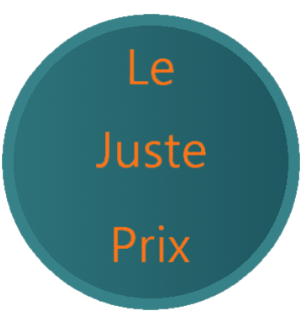

### Hi there 👋

Bonjour à tous; 

Je m’appelle Bastien, après une première aventure dans le domaine de l'immobilier ainsi que dans le domaine
aéronautique. J'ai faits le choix en 2021 de faire une reconversion en tant que DEVELOPPEUR WEB et WEB MOBILE.
Pour cela j'ai suivi une formation diplômante de 7 mois à l'ENI école informatique.

Aujourd'hui, je prends vraiment plaisir à concevoir et imaginer des projets personnels. # le code c'est cool 😄
Durant ma formation, j'ai adoré travailler sur J2EE ainsi que sur PHP. A ce jour je suis une formation sur Udemy ainsi qu'Open Class Room, pour monter en compétence sur JS et nodeJS.

####

Hi there;

My name is Bastien, after a first adventure in the field of real estate as well as in the field
aeronautics. I made the choice in 2021 to retrain as a WEB DEVELOPER and MOBILE WEB.
For this I followed a 7-month diploma course at the ENI computer school.

Today, I really enjoy designing and imagining personal projects. # the code is cool 😄
During my training, I loved working on J2EE as well as on PHP. To date I am training on Udemy as well as Open Class Room, to build skills on JS and nodeJS.

<!--
**Bloublu/Bloublu** is a ✨ _special_ ✨ repository because its `README.md` (this file) appears on your GitHub profile.

Here are some ideas to get you started:

- 🔭 I’m currently working on ...
- 🌱 I’m currently learning ...
- 👯 I’m looking to collaborate on ...
- 🤔 I’m looking for help with ...
- 💬 Ask me about ...
- 📫 How to reach me: ...
- 😄 Pronouns: ...
- ⚡ Fun fact: ...
-->

### Connect with me:
   
   

### Languages and Tools:

   

   

   

   

   

   

   

   

### ⭐ GitHub Stats and Languages

<!-- mise en commentaire des liens pour stats github et Languague car mise en place via balise img au dessus
lien pour stats : 

liens pour Languages: 

-->

### Training:
   
   